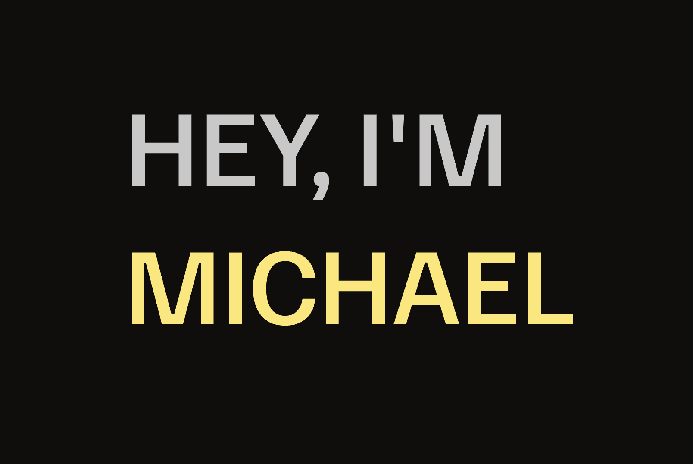

I'm a programmer working on my own website, [Code and Create](https://www.michalgrzebisz.com/) 🌐. Here are a few things about me:

- **Front-end Development**: I mainly work with **Next.js** 🖥️, but I love experimenting with various web technologies.
- **Web Design**: I strive to create websites that are not only functional but also aesthetically pleasing 🎨.
- **3D Graphics**: Previously, I worked as a 3D graphic designer, which adds a unique perspective to my current projects 🎥.

### When I'm not coding... 🧗‍♂️

In my free time, I enjoy bouldering. It's the perfect way for me to relax while also challenging myself physically and mentally 💪.

### Get in Touch 📬

Feel free to reach out to me on [LinkedIn](www.linkedin.com/in/michał-grzebisz-1a20b9214) or contact me through my [website](https://www.michalgrzebisz.com/).
